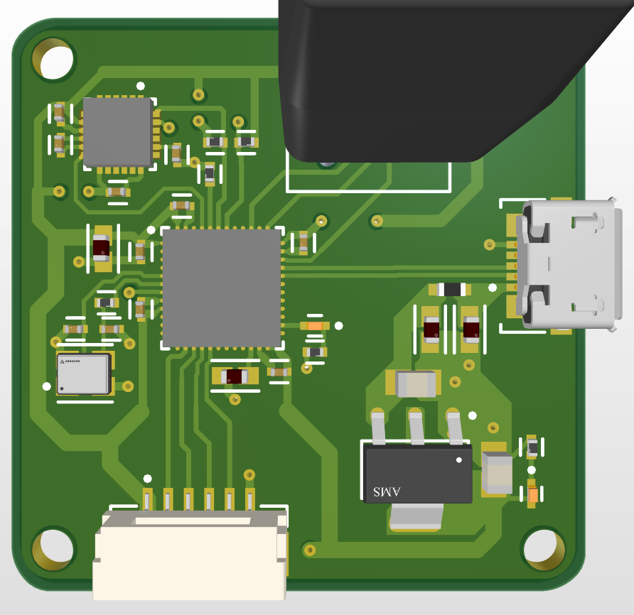

## PCB Layout

## Schematic

## Notes
- Some of the design rule violations are a result of the used footprints themselves.

- I couldn't do the second project due to technical difficulties in installing and even using Proteus (for some reason it wasn't able to create a project).